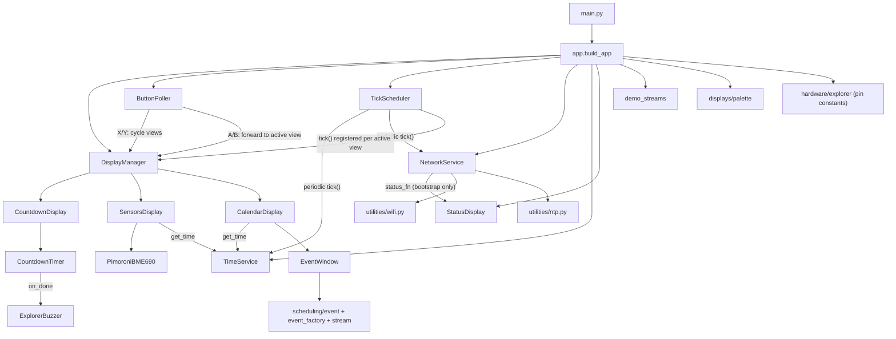

# Copilot instructions (pico-explorer-playground)

MicroPython app for the Pimoroni Pico Explorer (RP2040) using PicoGraphics.  Shows sensor readings, a configurable countdown timer with buzzer notification, and a horizontal calendar timeline of scheduled events.

See `ROADMAP.md` for planned features and design intent.

## Hardware / runtime constraints
- Target runtime: MicroPython 1.27.0 on RP2040 (Pimoroni build from https://github.com/pimoroni/pimoroni-pico).
- Display API: PicoGraphics, `PicoGraphics(display=DISPLAY_PICO_EXPLORER)`.
- Avoid allocations in hot paths, especially timer / IRQ callbacks.  Cache bound-method refs in `__init__` (`self._tick_ref = self._tick`) and use those in IRQ handlers.
- In timer IRQs, keep work tiny and defer via `micropython.schedule(...)`.  Guard schedule calls with a `_pending` flag; roll it back on exception so one failure doesn't wedge the state machine.
- Prefer `const(...)` for constants; keep math integer where possible.

## Virtual timer budget
MicroPython's `machine.Timer(-1)` allocates a *virtual* (software) timer slot.  The RP2040 Pimoroni build supports only a small fixed number of them (observed cap ≈ 8–10), and `Timer.deinit()` is not instantaneous — slots linger briefly.  Rapid create/deinit churn has, in the past, exhausted the pool and raised system exceptions.

**Rules:** prefer reusing a long-lived `Timer` over creating a fresh `Timer(-1)` per activation; update the inventory below whenever a new owner is added.

| Owner | File | Lifetime |
|---|---|---|
| `TickScheduler._timer` | `services/tick_scheduler.py` | permanent — drives all periodic subscribers |
| `PimoroniBME690._timer` | `services/pimoroni_bme690.py` | permanent — constant-interval gas-safe reads |
| `ExplorerBuzzer._alert_timer` | `services/explorer_buzzer.py` | permanent object, cycled via `init()` / `deinit()` per alert |
| `WifiClient._timer` | `utilities/wifi.py` | transient — only during `CONNECTING`; destroyed on `STAT_GOT_IP` / `STAT_WRONG_PASSWORD` / `reset()` |

Steady state: 3 permanent + ≤1 transient = 4 max.

## Architecture



**Key patterns:**

- **Entry point:** `src/pico/main.py` is a thin entry (~20 lines); `app.build_app(pico_graphics, micropython.schedule)` does all wiring and returns an `App` bag (`display_manager`, `tick_scheduler`, `button_poller`, `network_service`).
- **Display contract:** all displays inherit `displays.base.Display` (no-op defaults for `initialize` / `deinitialize` / `render` / `on_button_a` / `on_button_b`).  Each declares its redraw cadence via the `refresh_period_ms` class attribute (default `1000`; `0` = render every scheduler tick).
- **Display lifecycle:** `DisplayManager` owns a single `RefreshGate` rebuilt on every view switch from the active display's `refresh_period_ms` and the scheduler's `ms_per_tick`.  A/B button presses reset the gate *only* when the active display overrides the base handler (so stray presses on passive views don't disturb cadence).
- **Button handling:** `ButtonPoller` polls `machine.Pin` edges in the main loop and dispatches presses via `micropython.schedule()`.  X/Y cycle views; A/B are forwarded to the active view.
- **Hardware boundary:** `src/pico/hardware/explorer.py` centralizes GPIO pin constants.
- **TimeService:** central time authority; RTC holds UTC, `now()` returns local epoch (TZ + DST).  Must be created after NTP sync.  Exposes `to_utc()`, `total_offset()`, `real_duration()` for DST-aware math.  Consumers pass `time_service.now` as `get_time`.
- **NetworkService:** `status_fn` kwarg is only on `connect_and_sync_initial(...)`, not the constructor — periodic resyncs are silent so they never clobber the active view.
- **WiFi:** state lives in `WifiClient`; module-level `_DEFAULT` + PEP 562 `__getattr__` preserve the legacy `utilities.wifi.connect(...)` API for existing callers and tests.
- **Services** (`src/pico/services/`) are long-lived stateful objects created at startup, independent of display lifecycle.  Explorer- / Pimoroni-specific services use `Explorer*` / `Pimoroni*` naming to avoid shadowing built-in MicroPython modules.
- **Scheduling** (`src/pico/scheduling/`): `Event` carries wall-clock + DST-corrected durations; `EventWindow` is a passive sliding buffer over a forward-only event iterator; `Stream` bundles an `events_iter` + two RGB color tuples that `app.py` maps to pens.  `event_factory.work_week_loop` operates in local-epoch and advances its cursor by wall-clock duration to keep local boundaries aligned.
- **Demo streams** (`src/pico/demo_streams.py`) is temporary — slated for removal once the web configuration server lands.

## Testing
- Host-side pytest: `cd src && python -m pytest -q`.
- `src/tests/conftest.py` shims MicroPython-only modules (`micropython`, `machine`, `picographics`, `pimoroni`, `pimoroni_i2c`, `breakout_bme69x`, `ntptime`, `network`), MicroPython builtins (`const`), and MP-specific `time` functions (`ticks_ms`, `ticks_diff`, `ticks_add`, `sleep_ms`, `mktime` in UTC).
- Services and displays are tested via direct method calls with injected fakes (`schedule`, `timer_factory`, `pwm_factory`, `pin_factory`, `get_time`).  No real timer / schedule mocking needed.

## Coding conventions
- Minimal, targeted edits; keep public behavior stable unless requested.
- Keep MicroPython compatibility (avoid CPython-only modules unless guarded).
- Type hints — add them whenever the type is expressible:
  - Use full generics: `list[Event]`, `tuple[int, int, int, int]` — never plain `list`/`tuple`.  `X | None` is fine (MP 1.27+).
  - MP lacks `Callable` / `Iterator` / `Generator` — omit the annotation and leave an inline comment with the intended signature (e.g. `# () -> int`, `# Iterator[Event]`).
  - For containers whose element type is unhintable, simplify (`list[tuple]`) rather than using `object` as a stand-in.  For duck-typed collections, plain `list` is fine.
- Prefer small functions and clear names over cleverness.
- Comment only what needs clarification.

## Config / secrets
- WiFi credentials, timezone, and DST rules live in `src/pico/config.py` (git-ignored).  `src/pico/config.sample.py` is the committed template — copy it to `config.py` and fill in credentials.
- DST rules use tuple `(month, week, weekday, hour)` where `week=-1` = "last occurrence" and `weekday` uses MP's 0=Mon .. 6=Sun.  CET/CEST example:
  ```python
  TIME_ZONE_OFFSET = const(1)      # UTC+1 (CET)
  DST_START = (3, -1, 6, 2)        # Last Sun of March at 02:00 (standard)
  DST_END = (10, -1, 6, 3)         # Last Sun of October at 03:00 (DST)
  DST_OFFSET = const(1)            # +1 hour during DST
  ```

## Maintaining this file
Treat this file as a living document; propose updates whenever a task changes architecture, conventions, module structure, tooling, or the virtual-timer inventory.  Feature status and roadmap updates belong in `ROADMAP.md`.
