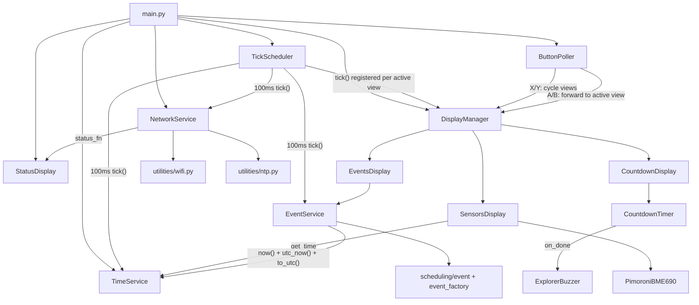

# Copilot instructions (pico-explorer-playground)

## Project summary
This is a MicroPython app for the Pimoroni Pico Explorer (RP2040) using PicoGraphics.
Main behavior: show a ring-style timer UI, cycle through scheduled events, and provide a configurable countdown timer with buzzer notification.

## Hardware / runtime constraints
- Target runtime: MicroPython 1.27.0 on RP2040 (Pimoroni build from https://github.com/pimoroni/pimoroni-pico).
- Display API: PicoGraphics (Pimoroni), using `PicoGraphics(display=DISPLAY_PICO_EXPLORER)`.
- Performance/memory: avoid unnecessary allocations in hot paths (especially timer callbacks).
- Interrupt/timer callbacks: keep callbacks tiny; prefer `micropython.schedule(...)` to run logic outside IRQ context.
- Prefer `const(...)` for constants; keep math integer where possible.

## Architecture



**Key patterns:**
- **Entry point:** `src/pico/main.py` wires everything at startup; `TickScheduler` (single 100ms PERIODIC timer) drives all `tick()` methods via `micropython.schedule()`.
- **Display lifecycle:** `DisplayManager` controls view init/deinit on cycle; each display registers/unregisters its own `_tick` with the scheduler inside its `initialize()`/`deinitialize()` methods.
- **Button handling:** `ButtonPoller` polls `machine.Pin` instances in the main loop with edge detection; presses dispatched via `micropython.schedule()`. X/Y cycle views; A/B forwarded to active view.
- **Services** (`src/pico/services/`) are long-lived stateful objects created at startup, independent of display lifecycle. Explorer/Pimoroni-specific services use naming convention (`Explorer*`, `Pimoroni*`).
- **TimeService** (`src/pico/services/time_service.py`) is the central time authority. The RTC holds UTC (set by NTP via `NetworkService`). `TimeService` computes local time by adding the timezone + DST offset. It exposes `now()` (local epoch), `utc_now()` (UTC epoch), `total_offset(utc_timestamp)` (offset in seconds at a given UTC instant), `to_utc(local_epoch)` (local→UTC conversion), and `real_duration(local_start, wall_clock_sec)` (DST-corrected real seconds). DST transitions are detected automatically on each `_tick()` via a cached threshold. Must be created after NTP sync. All time-displaying consumers use `TimeService.now` as their `get_time` source.
- **Displays** (`src/pico/displays/`) are view-specific, each following a `Geometry`/`Renderer`/`Display` pattern where applicable.
- **Utilities** (`src/pico/utilities/`) provide low-level WiFi and NTP functionality.
- **Scheduling** (`src/pico/scheduling/`) contains the event model (`Event` with wall-clock `duration_sec` and DST-corrected `real_duration_sec`) and factory iterators. The factory (`event_factory.work_week_loop`) operates in local-epoch, accepting local work hours and a `TimeService` instance. At yield time it computes `real_duration_sec` via `TimeService.real_duration()`. Cursor advances by wall-clock duration to keep local boundaries aligned.
- **Tests** (`src/tests/`) run on the host with CPython + pytest; `src/tests/conftest.py` provides shims for MicroPython-only modules.

## Testing expectations
- Host-side tests exist under `src/tests/` (pytest).
- `src/tests/conftest.py` provides shims/stubs for MicroPython-only modules (`micropython`, `machine`, `picographics`, `pimoroni`, `pimoroni_i2c`, `breakout_bme69x`, `ntptime`, `network`) and the `const()` builtin so that `src/pico/` code can be imported under CPython. The `machine` stub includes `Timer`, `Pin`, and `PWM`; the `pimoroni` stub includes `Button`. Also stubs `time.ticks_ms`, `time.ticks_diff`, `time.ticks_add`, `time.sleep_ms`, and `time.mktime` (MicroPython-compatible: 8-tuple, UTC, no local TZ) for CPython compatibility. Explorer-specific code lives under `src/pico/services/` with naming convention (`Explorer*`, `Pimoroni*`) to avoid shadowing the built-in `pimoroni` module on MicroPython.
- Individual tests use fakes (e.g., `FakeRenderer`, `FakeBME69X`, `FakeScheduler`) to isolate logic from hardware.
- Keep logic testable via dependency injection (e.g., `get_time`, `pwm_factory`, `pin_factory` patterns already used).
- Services and displays expose `tick()` methods tested directly — no timer/schedule mocking needed.
- Don’t add heavy new dependencies unless necessary.

## Coding conventions for changes
- Make minimal, targeted edits; keep the public behavior stable unless explicitly requested.
- Keep MicroPython compatibility (avoid CPython-only modules unless guarded).
- Type hints — always add when the type is expressible; keep them honest:
  - **Always hint** parameters and return types (including `-> None`) when the type is a built-in (`int`, `str`, `bool`, `float`) or a class importable from MicroPython or the codebase.
  - **Use full generics** — `tuple[int, int, int, int]`, not plain `tuple`. `list[Event]`, not plain `list`.
  - **Union with None** — `X | None` is supported in MicroPython 1.27+ and preferred over omitting the hint.
  - **Callables and factories** — MicroPython lacks `Callable`. Omit the annotation; add an inline comment with the intended signature, e.g. `# () -> int` or `# type[PWM]`.
  - **Iterators/generators** — MicroPython lacks `Iterator`/`Generator`. Omit the annotation; add a comment, e.g. `# Iterator[Event]`.
  - **Containers with unhintable element types** — simplify the element type rather than using `object` as a stand-in (e.g. `list[tuple]` rather than `list[tuple[Pin, object, bool]]`).
  - **Duck-typed collections** (no shared base class or protocol) — use the plain container type (`list`), no element type, no comment.
  - Importing a class solely for use in type hints is acceptable.
- Prefer small functions and clear names over cleverness.
- If changing rendering/timing, ensure ring/text updates remain incremental and efficient.

## Config / secrets
- WiFi credentials/timezone/DST rules are provided via a local `config.py`.
- Do not commit real credentials; use a sample file if needed.
- DST rules use tuple format `(month, week, weekday, hour)` where `week=-1` means "last occurrence" and `weekday` uses MicroPython convention (0=Mon .. 6=Sun). Example for CET/CEST:
  ```python
  TIME_ZONE_OFFSET = const(1)       # UTC+1 (CET)
  DST_START = (3, -1, 6, 2)        # Last Sunday of March at 02:00 (standard time)
  DST_END = (10, -1, 6, 3)         # Last Sunday of October at 03:00 (DST time)
  DST_OFFSET = const(1)            # +1 hour during DST (CEST = UTC+2)
  ```

## Planned direction (non-binding)
These are goals/intent to guide design choices. They are not requirements unless explicitly requested in a task.

- Multi-screen UI (**implemented, evolving**): hardware buttons (X/Y) cycle between independent display views via `ButtonPoller` (polled in main loop). Currently three views exist: Sensors, Events, and Countdown. Each view has `initialize()` / `deinitialize()` lifecycle methods; `DisplayManager` manages the active view index, switching, and forwarding A/B button presses to the active display. Views that handle buttons implement `on_button_a()` / `on_button_b()` methods.
- Countdown timer (**implemented**): `CountdownTimer` service is a pure timer engine with `on_done`/`on_configure` callbacks. Accepts `configure(name, total_sec)` to set/reset presets, `start()`/`pause()`/`resume()`/`reset()` for state transitions. The display owns duration presets (`DURATIONS`/`LABELS`) and cycling logic, and bootstraps the timer via `configure()` in its constructor. `ExplorerBuzzer.play_alert` is wired as `on_done`; `stop_alert` as `on_configure`. The countdown keeps ticking (and buzzer fires) even when the user switches to another display. `countdown.Display` is a rendering-only view that reads engine state on `initialize()` and renders accordingly.
- Sensor dashboard view (**partially implemented**): shows BME690 readings (temperature, pressure, humidity, gas resistance, heater status) and a header with local time (via `TimeService.now`). `PimoroniBME690` service runs independently, continuously reading sensor data. History graphs are planned but not yet implemented. Show current time/date at the top.
- Calendar view: an Outlook-like calendar in horizontal mode where time progresses left-to-right. Show current time/date at the top.
- Web configuration: add a tiny web server to define one-shot and repeated (daily/weekly/…) timers. One-shot timers map to a single event; repeated timers map to multiple events repeating in a circle (similar to the current ring timer behavior).

Design implications:
- Keep views modular (separate rendering + state per view) and avoid hard-coding assumptions that there is only one screen.
- Due to the 240×240 display constraint, only the Sensors and Calendar views should share a common header (time/date); other views may use the full screen.
- Header typography (Sensors/Calendar): use `bitmap6` at x3 scale, single line, plus ~3px bottom margin.
- Prefer clean boundaries between data acquisition (sensors/network), scheduling, and rendering.
- Be mindful of MicroPython constraints: small memory footprint and minimal allocations in tight refresh/update loops.

## Maintaining this file
This file (`copilot-instructions.md`) should be maintained by Copilot. When making changes to the codebase that affect architecture, conventions, module structure, or project direction, Copilot should propose updates to this file to keep it accurate and in sync with the actual state of the code. This includes:
- Adding or removing modules, entry points, or display views.
- Changes to coding conventions, testing patterns, or dependency injection approaches.
- New hardware integrations or sensor support.
- Progress on planned features (moving items from "planned" to documented reality).
- Updates to build/test tooling or project configuration.

Copilot should treat this file as a living document and update it proactively as part of completing tasks, rather than letting it drift out of date.