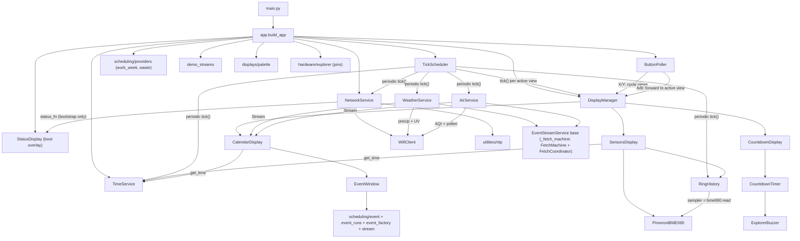

# Copilot instructions (pico-explorer-playground)

MicroPython app for the Pimoroni Pico Explorer (RP2040), built on PicoGraphics. See `README.md` for layout/setup, `ROADMAP.md` for feature state and design intent, and `src/pico/config_defaults.py` for the config schema.

## Deployment boundary
Everything under `src/pico/` is uploaded *verbatim* to the device (MicroPico, `"micropico.syncFolder": "pico"`) and consumes flash, so keep it to runtime code the app actually imports. Everything else lives outside it: host tests → `src/tests/`, build/codegen tooling → `src/tools/`, source art → `src/assets/`, reference data and scratch docs → `src/docs/`.

## Runtime constraints (MicroPython 1.27.0 / RP2040, Pimoroni build)
- Display: `PicoGraphics(display=DISPLAY_PICO_EXPLORER)`.
- Avoid allocations in hot paths (render loop, timer/IRQ callbacks). Cache bound-method refs in `__init__` (`self._tick_ref = self._tick`) and use those from IRQs — MP bound methods compare by identity, so caching also makes scheduler-registry dedup reliable.
- In timer IRQs keep work tiny and defer via `micropython.schedule(...)`; guard with a `_pending` flag and roll it back on exception so one failure doesn't wedge the state machine.
- **Single Python thread:** scheduled callbacks and the main-loop button poll share one thread (no event loop, no background thread), so blocking work in a `schedule(...)` callback (e.g. an HTTP fetch) freezes rendering *and* buttons until it returns. Network fetches use a tick-driven fetch machine (`services/_fetch_machine.py`, owned by `services/_event_stream_service.py`) bounded by a short `config.HTTP_TIMEOUT_S`, not `asyncio`/`_thread` (lwIP isn't multi-core-safe; the rp2 GIL negates threading).
- Prefer `const(...)`; keep math integer where possible.
- **Spritesheet preload:** `main.py` loads `icons_symbols.rgb332` (16 KiB) *before* `from app import build_app` — MP's non-compacting GC fragments the heap early and a later 16 KiB contiguous alloc can fail.
- **Network memory:** HTTPS/TLS *and* large HTTP responses both hit ENOMEM on the fragmented heap (mbedtls needs a ~16 KiB contiguous block; `requests` allocates ~response-size). So Open-Meteo is fetched over **plain HTTP** (public/keyless) with a small `forecast_hours` window — the air-quality body at `forecast_days=2` (~2.5 KiB) failed "allocating 2560 bytes"; ~4 h keeps each body <1 KiB. Bound response size for any new fetch.

## Virtual timer budget
`machine.Timer(-1)` allocates a *virtual* (software) slot; the Pimoroni build has only a small fixed pool (observed ≈ 8–10) and `deinit()` lingers, so rapid create/deinit churn can exhaust it. **Reuse a long-lived `Timer` over creating one per activation; update this table when adding an owner.** If your change introduces a new `machine.Timer` owner, you MUST add a row to the Timer budget table in this file and recount the steady-state total before presenting the code.

| Owner | File | Lifetime |
|---|---|---|
| `TickScheduler._timer` | `services/tick_scheduler.py` | permanent — drives all periodic subscribers |
| `PimoroniBME690._timer` | `services/pimoroni_bme690.py` | permanent — constant-interval gas-safe reads |
| `ExplorerBuzzer._alert_timer` | `services/explorer_buzzer.py` | permanent object, cycled via `init()` / `deinit()` per alert |
| `WifiClient._timer` | `services/wifi_client.py` | transient — only while `CONNECTING` |

Steady state: 3 permanent + ≤1 transient = 4 max.

## Architecture

**Patterns** (the non-obvious *why*; mechanics live in the code):

- **Entry point:** `main.py` is thin — bootstraps config, allocates the framebuffer, preloads the spritesheet, then `app.build_app(pico_graphics, micropython.schedule)` returns an `App` bag (`display_manager`, `tick_scheduler`, `button_poller`, `network_service`). `app.py` is the single composition site for services + displays.
- **Composition-root derivations (single source of truth):** a value that's a function of *other* modules' constants — or shared by several — gets one owner and is derived + injected from `app.py` (which already wires both ends), never hardcoded in a leaf module. The owner exposes that constant **public** (`WINDOW_FUTURE_SEC`, not `_…` — MP drops `_`-prefixed `const` from the module namespace, so it can't be imported); consumers take it as a required param and stay layer-independent (`services/` never imports `displays/`). A magic number justified only by a comment is a smell — derive it when the inputs are reachable (the network-streams `forecast_hours` below is the worked example).
- **Displays** inherit `displays.base.Display` (no-op `initialize` / `deinitialize` / `render` / `on_button_a` / `on_button_b`); the `refresh_period_ms` class attr sets redraw cadence (default `1000`; `0` = render every scheduler tick). `DisplayManager` rebuilds one `RefreshGate` per view switch; A/B presses reset the gate *only* when the active view overrides the base handler (stray presses on passive views don't disturb cadence).
- **TimeService:** central time authority — RTC holds UTC, `now()` returns local epoch (TZ + DST). Must be created *after* NTP sync; exposes `to_utc()` / `total_offset()` / `real_duration()` for DST-aware math. Consumers pass `time_service.now` as `get_time`.
- **NetworkService:** `status_fn` is a kwarg on `connect_and_sync_initial(...)` only, not the constructor — periodic resyncs are silent so they never clobber the active view.
- **RingHistory** (`services/ring_history.py`): generic N-metric ring buffer; takes a positional `sampler` (a bound method, no closure) plus keyword `num_metrics` / `capacity` / `ticks_per_commit`, and bumps `commit_count` so consumers detect new data cheaply. The Sensors view uses one instance (`num_metrics=4`) for 24 h of BME690 history, registered once in `app.py` via its cached `_tick_ref` (no new `Timer`).
- **Sensor bands:** `config.SENSOR_*_BANDS` are 5-tuples (shape documented in `config_defaults.py`). *Structural* shape is enforced by `config_bootstrap.apply_overrides`; *semantic* invariants (strictly ascending, unique) by `_validate_sensor_bands_or_halt` in `app.py`.
- **Services** (`services/`) are long-lived, created at startup, independent of display lifecycle. Explorer- / Pimoroni-specific ones use `Explorer*` / `Pimoroni*` names to avoid shadowing built-in MP modules.
- **Scheduling** (`scheduling/`): `Event` carries DST-corrected durations plus a `color_index` into `displays/palette.STREAM_COLORS` (mapped to pens once in `app.py`); `EventWindow` is the per-row calendar view-model (reuses an internal buffer — no per-frame allocation); `Stream` bundles a row's `events_iter` plus optional refresh / status hooks used by network streams. `event_runs.py` holds the pure bar-assembly primitives shared by the network services: `_level` (threshold→0/1/2), `best_by_priority` (per-hour conflict pick), `merge_runs` (contiguous equal `(label,color)` hours → `Event` bars).
- **Network calendar streams** (`services/`): `WeatherService` (precip + UV, one Open-Meteo *forecast* fetch) and `AirService` (AQI + pollen, one *air-quality* fetch — separate host) are thin `EventStreamService` subclasses (only `_fetch_and_parse` + config differ): the base owns the fetch loop — *when* to fetch (interval + exponential backoff), the `status`/`generation` the calendar polls, and publishing — driving a stateless `FetchMachine` over a transient `FetchState` (allocated per fetch, GC'd once the owner harvests its result on the next tick). A shared `FetchCoordinator` serialises fetches (one thread → not for safety, but so two services due in the same tick don't freeze rendering back-to-back). They publish `Event` bars the calendar reads passively. A row bundles temporally anti-correlated metrics; per-hour conflicts resolve **at fetch time** by priority (`event_runs.best_by_priority`) so the render path stays allocation-free. The calendar windows (`displays/calendar.WINDOW_*_SEC`, public) are *owned by the calendar*; `app.py` owns the fetch cadence and **derives** both `forecast_hours = ceil((WINDOW_FUTURE_SEC + 2×refresh + 1 h)/1 h)` and `past_hours = ceil(WINDOW_PAST_SEC/1 h)` (the API's `forecast_hours` starts at the current hour, so `past_hours` keeps the past strip populated), injecting cadence + both horizons into the services (no value is hardcoded in the services or `openmeteo_client`).
- **Stream providers** (`scheduling/providers/`, namespace packages — no `__init__.py`): pure on-device generators built once at boot — `work_week` and `waste` (`config.WASTE_SCHEDULE`). `demo_streams.py` fills remaining calendar rows and is temporary (see `ROADMAP.md`).
- **Hardware / assets:** `hardware/explorer.py` centralizes GPIO pin constants. The spritesheet API lives in `displays/shared/icons_symbols.py`; regenerate `icons_symbols.rgb332` from `src/assets/icons_symbols.png` via `src/tools/regenerate-icons.bat`.

## Testing
- Host pytest: `cd src && python -m pytest -q` (no MicroPython runtime needed).
- `src/tests/conftest.py` shims MP-only modules (e.g. `micropython`, `machine`, `picographics`, `pimoroni`, `pimoroni_i2c`, `breakout_bme69x`, `ntptime`, `network`, `urequests`), the `const` builtin, and MP `time` funcs (`ticks_ms` / `ticks_diff` / `ticks_add` / `sleep_ms`, plus `mktime` / `gmtime` in UTC).
- Services / displays are tested via direct method calls with injected fakes (`schedule`, `timer_factory`, `pwm_factory`, `pin_factory`, `get_time`) — no real timer / schedule mocking.
- `app.py` composition has no host-test coverage (importing it needs `config` + machine shims), so verify wiring changes there manually and ask the user to also verify on-device.

## Coding conventions
- Minimal, targeted edits; keep public behavior stable unless asked. Keep MicroPython compatibility (no CPython-only modules unless guarded). Small functions, clear names.
- Comments — only for non-obvious decisions (e.g. why a workaround is needed, hardware-specific constraints); don't comment code whose meaning is clear from its name and types.
- Type hints — apply this decision table in order:
  1. If the type is fully expressible in MicroPython (`int`, `str`, `list[X]`, `tuple[X,…]`, `X | None`): annotate normally — use full generics (`list[Event]`, `tuple[int, int, int, int]`), never bare `list` / `tuple`.
  2. If the type is not expressible in MicroPython (`Callable`, `Iterator`, `Generator`): omit the annotation; add an inline comment with the intended signature (e.g. `# () -> int`, `# Iterator[Event]`).
  3. If only the element type is unhintable or duck-typed: use bare `list` or `list[tuple]`; never use `object`.

## Config / secrets
- `config_defaults.py` is the committed schema + defaults; `config.py` is git-ignored and may hold a sparse subset of overrides. At boot `config_bootstrap.apply_overrides()` merges defaults over the user module *in place* in `sys.modules['config']`, so `import config` / `config.X` consumers work unchanged.
- **`config.py` is git-ignored but present on disk and readable** (`src/pico/config.py`) — inspect it to see the user's *actual* overrides (e.g. `LATITUDE` / `LONGITUDE`, WiFi) when debugging on-device behavior. It contains secrets (`WIFI_PASSWORD`): never echo, log, or commit them.
- Compatibility is **structural only**: each override must match its default's Python type (tuples match length + per-element type); one widening — an `int` override where the default is `float` — is allowed. Mismatch raises `InvalidConfigError` and halts. Unknown public `UPPER_SNAKE_CASE` keys warn (`config: ignoring unknown key …`) but don't halt; a missing `config.py` raises `MissingConfigError`.
- **Adding a key:** append it to `config_defaults.py` and read it as `config.X` (no `getattr` defaults; tests pass values explicitly). Remind the user to override it in `config.py` if they want a non-default value.

## Maintaining this file
Living document — when a change makes part of this file stale, edit the affected lines in the *same* change, not a deferred pass. Capture the non-obvious *why* and structural map; don't duplicate code or restate mechanics the code already makes obvious. Feature status and roadmap belong in `ROADMAP.md`.
