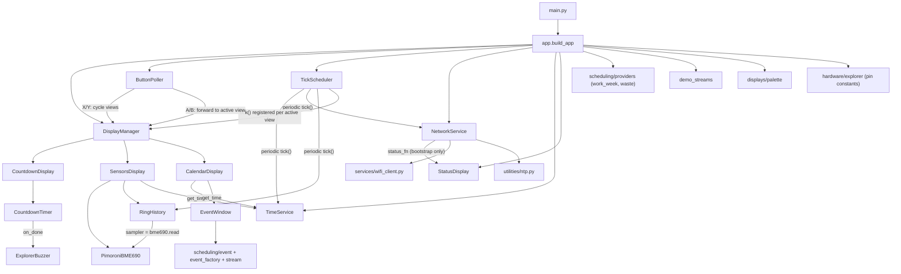

# Copilot instructions (pico-explorer-playground)

MicroPython app for the Pimoroni Pico Explorer (RP2040) using PicoGraphics.  Shows sensor readings, a configurable countdown timer with buzzer notification, and a horizontal calendar timeline of scheduled events.

See `ROADMAP.md` for planned features and design intent.

## Hardware / runtime constraints
- Target runtime: MicroPython 1.27.0 on RP2040 (Pimoroni build from https://github.com/pimoroni/pimoroni-pico).
- Display API: PicoGraphics, `PicoGraphics(display=DISPLAY_PICO_EXPLORER)`.
- Avoid allocations in hot paths, especially timer / IRQ callbacks.  Cache bound-method refs in `__init__` (`self._tick_ref = self._tick`) and use those in IRQ handlers.
- In timer IRQs, keep work tiny and defer via `micropython.schedule(...)`.  Guard schedule calls with a `_pending` flag; roll it back on exception so one failure doesn't wedge the state machine.
- **Single Python thread:** scheduled callbacks and the main-loop button poll all run on one thread — no event loop, no background thread.  So blocking work in a `schedule(...)` callback (e.g. an HTTP fetch) freezes rendering *and* buttons until it returns.  Network fetches use a tick-driven state machine (`services/_fetch_state.py`) bounded by a short `config.HTTP_TIMEOUT_S` (default 3 s) — not `asyncio`/`_thread` (lwIP isn't multi-core-safe; the rp2 GIL negates threading).
- Prefer `const(...)` for constants; keep math integer where possible.
- **Spritesheet preload:** `src/pico/icons_symbols.rgb332` (16 KiB) must be loaded in `main.py` *before* `from app import build_app` — MP's non-compacting GC fragments heap early and a later 16 KiB contiguous alloc can fail.

## Virtual timer budget
MicroPython's `machine.Timer(-1)` allocates a *virtual* (software) timer slot.  The RP2040 Pimoroni build supports only a small fixed number of them (observed cap ≈ 8–10), and `Timer.deinit()` is not instantaneous — slots linger briefly.  Rapid create/deinit churn has, in the past, exhausted the pool and raised system exceptions.

**Rules:** prefer reusing a long-lived `Timer` over creating a fresh `Timer(-1)` per activation; update the inventory below whenever a new owner is added.

| Owner | File | Lifetime |
|---|---|---|
| `TickScheduler._timer` | `services/tick_scheduler.py` | permanent — drives all periodic subscribers |
| `PimoroniBME690._timer` | `services/pimoroni_bme690.py` | permanent — constant-interval gas-safe reads |
| `ExplorerBuzzer._alert_timer` | `services/explorer_buzzer.py` | permanent object, cycled via `init()` / `deinit()` per alert |
| `WifiClient._timer` | `services/wifi_client.py` | transient — only during `CONNECTING`; destroyed on `STAT_GOT_IP` / `STAT_WRONG_PASSWORD` / `reset()` |

Steady state: 3 permanent + ≤1 transient = 4 max.

## Architecture



**Key patterns:**

- **Entry point:** `src/pico/main.py` is a thin top-level script that runs the config bootstrap, allocates the framebuffer, preloads the spritesheet, then hands off to `app.build_app(pico_graphics, micropython.schedule)` which returns an `App` bag (`display_manager`, `tick_scheduler`, `button_poller`, `network_service`).
- **Display contract:** all displays inherit `displays.base.Display` (no-op defaults for `initialize` / `deinitialize` / `render` / `on_button_a` / `on_button_b`).  Each declares its redraw cadence via the `refresh_period_ms` class attribute (default `1000`; `0` = render every scheduler tick).
- **Display lifecycle:** `DisplayManager` owns a single `RefreshGate` rebuilt on every view switch from the active display's `refresh_period_ms` and the scheduler's `ms_per_tick`.  A/B button presses reset the gate *only* when the active display overrides the base handler (so stray presses on passive views don't disturb cadence).
- **Button handling:** `ButtonPoller` polls `machine.Pin` edges in the main loop and dispatches presses via `micropython.schedule()`.  X/Y cycle views; A/B are forwarded to the active view.
- **Hardware boundary:** `src/pico/hardware/explorer.py` centralizes GPIO pin constants.
- **Shared display assets:** `displays/shared/icons_symbols.py` owns the spritesheet API (`load`, `draw_icon`, `draw_sprite`, `ICON_*` / `UNIT_*` cell constants; all draws pass `transparent=0`). Source PNG lives at `src/assets/icons_symbols.png`; regenerate `src/pico/icons_symbols.rgb332` via `src/tools/regenerate-icons.bat` (wraps `src/tools/spritesheet-to-rgb332.py`).
- **TimeService:** central time authority; RTC holds UTC, `now()` returns local epoch (TZ + DST).  Must be created after NTP sync.  Exposes `to_utc()`, `total_offset()`, `real_duration()` for DST-aware math.  Consumers pass `time_service.now` as `get_time`.
- **NetworkService:** `status_fn` kwarg is only on `connect_and_sync_initial(...)`, not the constructor — periodic resyncs are silent so they never clobber the active view.
- **WiFi:** `WifiClient` is a service instantiated in `app.py` and injected into `NetworkService`. It owns its own `machine.Timer` (transient — only during CONNECTING) and state machine.
- **RingHistory:** generic N-metric ring-buffer service in `services/ring_history.py`; the Sensors view uses one instance with `num_metrics=4` to hold 24 h of BME690 history.  Takes a positional `sampler` callable (`app.py` passes `bme690.read` — a bound method, no closure allocation) plus keyword `num_metrics` / `capacity` / `ticks_per_commit`.  Pre-allocates `num_metrics` `array.array('f')` ring buffers; commits one snapshot every `ticks_per_commit` scheduler ticks; bumps `commit_count` so consumers can detect "new data" cheaply.  For the Sensors view, capacity (= graph_width in px) and `ticks_per_commit` are derived in `sensors.Geometry` from the actual measured 4-char value-text width + the 24-hour budget.  Registration on `TickScheduler` happens **once** in `app.py` (single site) using the cached `self._tick_ref` — MicroPython bound methods compare by identity, so the cache is what makes `register`'s `not in` dedup reliable.  No new `machine.Timer`.
- **Sensor band edges:** `config.SENSOR_*_BANDS` is a 5-tuple `(cap_min, t1, t2, t3, cap_max)` per metric.  Inner three drive icon-swap classification (4 bands); outer two define the history-graph Y axis (cap_max → top, cap_min → bottom).  Tuple shape is structurally enforced by `config_bootstrap.apply_overrides` (mismatched length or element type halts boot); semantic invariants (strictly ascending, unique) are backstopped on the panel by `_validate_sensor_bands_or_halt` in `app.py`.
- **Services** (`src/pico/services/`) are long-lived stateful objects created at startup, independent of display lifecycle.  Explorer- / Pimoroni-specific services use `Explorer*` / `Pimoroni*` naming to avoid shadowing built-in MicroPython modules.
- **Scheduling** (`src/pico/scheduling/`): `Event` carries wall-clock + DST-corrected durations plus a `color_index`; `EventWindow` is the per-row calendar view-model (sliding buffer that also resolves each bar's pen at fill time); `Stream` bundles just an `events_iter`.  Bar colors come from `Event.color_index`, a 0-based index into the shared `displays/palette.STREAM_COLORS` list that `app.py` maps to pens once and shares across all rows via `build_event_windows`.  `event_factory.work_week_loop` operates in local-epoch and advances its cursor by wall-clock duration to keep local boundaries aligned.
- **Stream providers** (`src/pico/scheduling/providers/`): pure on-device generators built once at boot — `work_week` (work/rest/weekend) and `waste` (recurring `config.WASTE_SCHEDULE`, advancing each entry by `period_weeks` in local-epoch).  No `__init__.py` (namespace packages).
- **Demo streams** (`src/pico/demo_streams.py`) are temporary placeholders filling the remaining calendar rows — slated for removal once the web configuration server lands.

## Testing
- Host-side pytest: `cd src && python -m pytest -q`.
- `src/tests/conftest.py` shims MicroPython-only modules (`micropython`, `machine`, `picographics`, `pimoroni`, `pimoroni_i2c`, `breakout_bme69x`, `ntptime`, `network`), MicroPython builtins (`const`), and MP-specific `time` functions (`ticks_ms`, `ticks_diff`, `ticks_add`, `sleep_ms`, `mktime` in UTC).
- Services and displays are tested via direct method calls with injected fakes (`schedule`, `timer_factory`, `pwm_factory`, `pin_factory`, `get_time`).  No real timer / schedule mocking needed.

## Coding conventions
- Minimal, targeted edits; keep public behavior stable unless requested.
- Keep MicroPython compatibility (avoid CPython-only modules unless guarded).
- Type hints — add them whenever the type is expressible:
  - Use full generics: `list[Event]`, `tuple[int, int, int, int]` — never plain `list`/`tuple`.  `X | None` is fine (MP 1.27+).
  - MP lacks `Callable` / `Iterator` / `Generator` — omit the annotation and leave an inline comment with the intended signature (e.g. `# () -> int`, `# Iterator[Event]`).
  - For containers whose element type is unhintable, simplify (`list[tuple]`) rather than using `object` as a stand-in.  For duck-typed collections, plain `list` is fine.
- Prefer small functions and clear names over cleverness.
- Comment only what needs clarification.

## Config / secrets
- `src/pico/config_defaults.py` is the committed schema and defaults (WiFi, TZ/DST, sensor offsets/bands); `src/pico/config.py` is git-ignored and may hold a sparse subset of overrides — any key the user doesn't override falls back to the default.
- At boot, `config_bootstrap.apply_overrides()` imports `config_defaults`, imports `config`, and **mutates the imported user module in place** so any default not overridden gets copied onto it.  The merged module lives at `sys.modules['config']`, so existing `import config` / `config.X` consumers work unchanged.
- **Compatibility = structural type/shape only.**  Each override must have the same Python type as its default; tuples must match length and per-element types.  One widening is allowed: an `int` override is accepted where the default is `float`.  Any mismatch raises `InvalidConfigError` and halts boot.  Public `UPPER_SNAKE_CASE` keys on the user module that aren't in defaults produce a `print("config: ignoring unknown key 'FOO'")` warning but do **not** halt — useful typo guard.
- **Missing config:** `config.py` absent → `MissingConfigError` with a message telling the user to copy `config_defaults.py` and edit `WIFI_SSID` / `WIFI_PASSWORD`.  Loader does **no** file I/O; it never auto-creates anything.  Placeholder credentials are intentionally not detected — the WiFi connect surfaces them.
- **Adding a key:** append it to `config_defaults.py`.  No comment-block conventions, no schema versions.  Access via `config.X` — no `getattr` defaults; tests pass values explicitly.
- DST rules use tuple `(month, week, weekday, hour)` where `week=-1` = "last occurrence" and `weekday` uses MP's 0=Mon .. 6=Sun.  CET/CEST example:
  ```python
  TIME_ZONE_OFFSET = const(1)      # UTC+1 (CET)
  DST_START = (3, -1, 6, 2)        # Last Sun of March at 02:00 (standard)
  DST_END = (10, -1, 6, 3)         # Last Sun of October at 03:00 (DST)
  DST_OFFSET = const(1)            # +1 hour during DST
  ```

## Maintaining this file
Treat this file as a living document; propose updates whenever a task changes architecture, conventions, module structure, tooling, or the virtual-timer inventory.  Feature status and roadmap updates belong in `ROADMAP.md`.
